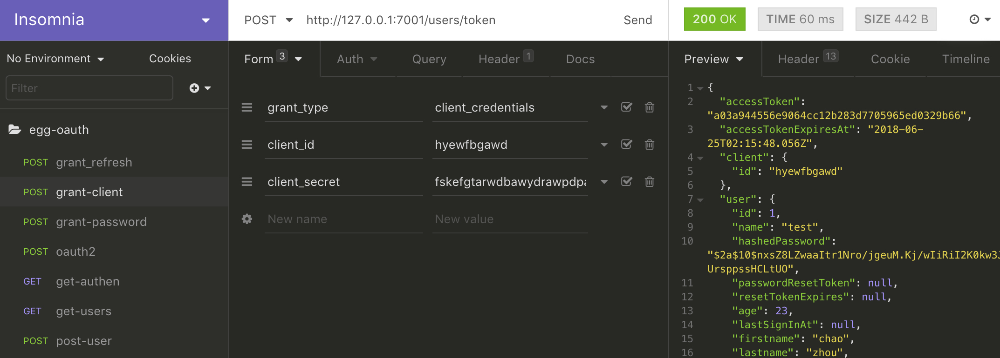

[理解 OAuth 2.0 ](http://www.ruanyifeng.com/blog/2014/05/oauth_2_0.html)

[基于 OAuth 2.0 的 egg-oauth2-server 源码](https://github.com/Azard/egg-oauth2-server)

[基于 egg-oauth2-server 的授权测试源码](https://github.com/caiya/eggjs-oAuth2-server)

几点补充: 

 - config.default.js : 

 在  grants: ['password', 'authorization_code', 'refresh_token'] 中 添加 'client_credentials' .

 - users.js : 

 同理.  grants: 'password,authorization_code,refresh_token,client_credentials' .

 - oauth.js: 添加

 ```
     async getUserFromClient(client) {
	      const user = await this.ctx.model.User.findOne({
	        where: {
	          name: 'test'
	        }
	      })
	      return user
     }
 ```

 - user.js : 添加

 ```
	 User.findByName = async function(name){
	    return await this.findOne({
	      where: {name: name},
	      attributes: ['id', 'name', 'age', 'firstname', 'lastname']
	    })
	 }
 ```

 - config.default.js : 启动服务器之前一定要按照自己电脑的 MySQL 配置修改 sequelize 的相应参数.

 ```
     sequelize: {
	      dialect: 'mysql', // support: mysql, mariadb, postgres, mssql
	      database: 'oAuthCenter',
	      host: '127.0.0.1',
	      port: '3306',
	      username: 'root',
	      password: ''
     },
  ```

  - 测试授权流程之前先注册用户 . code 代表授权码 ; accessToken 代表访问令牌

  ### client 分支

  client 会利用 redirect uri 的路由, 携带上面 server 返回的授权码 code , '暗中'请求服务端的访问令牌 token :

  ```javascript
   router.get('/auth/redirect', controller.auth.redirect);
  ```

```
  const redirect_uri = 'http://127.0.0.1:7002/auth/redirect'
```

```
  async redirect(){
    //查看 code
    console.log(this.ctx.query)
    const result = await this.ctx.curl('http://127.0.0.1:7001/users/token', {
      dataType: 'json',
      method: 'POST',
      timeout: 3000,
      data: {
        grant_type: 'authorization_code',
        code: this.ctx.query.code,
        state: this.ctx.query.state,
        client_id: client_id,
        client_secret: client_secret,
        redirect_uri: redirect_uri,
      }
    });
    //查看 accessToken
    this.ctx.body = result.data;
  }
}
```


   


